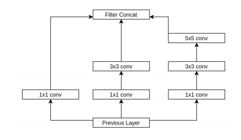
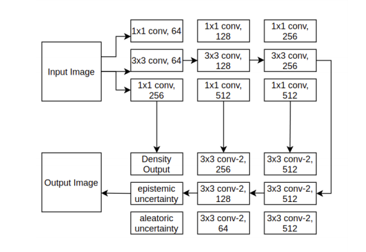
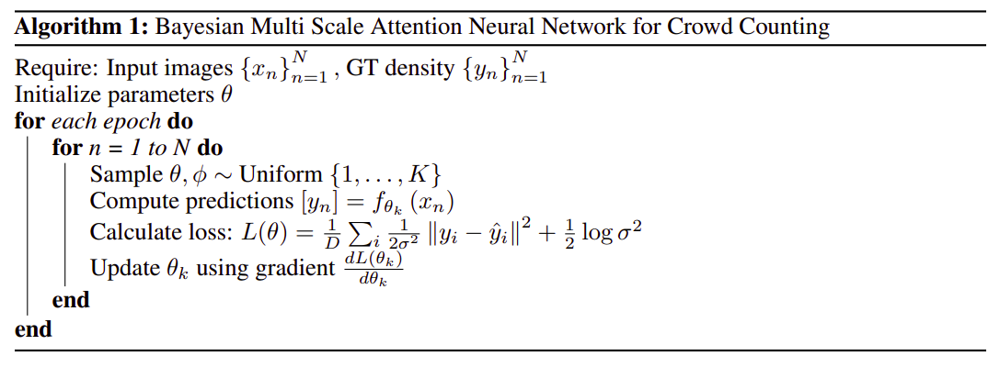
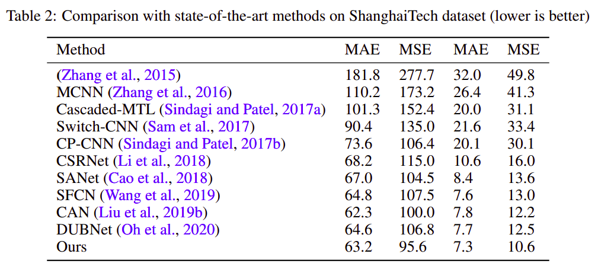
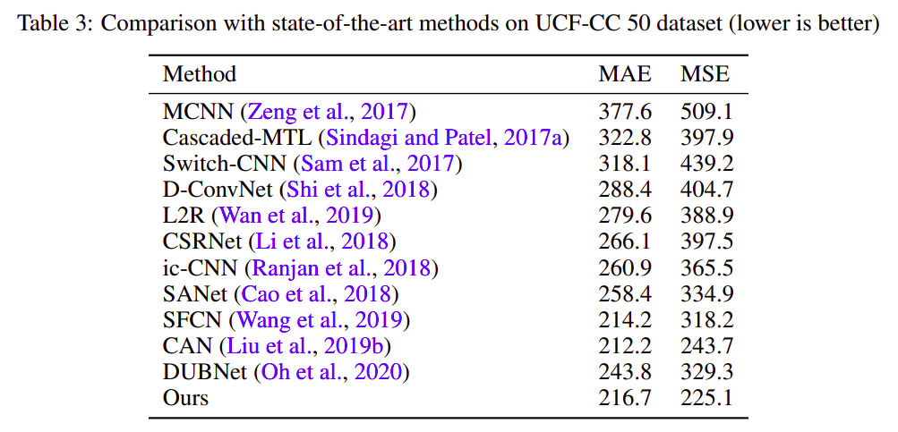
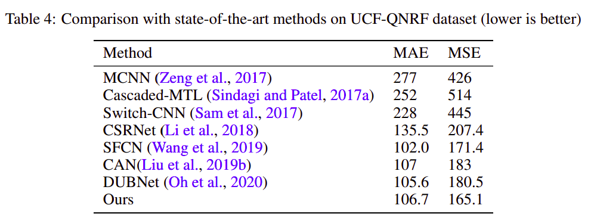
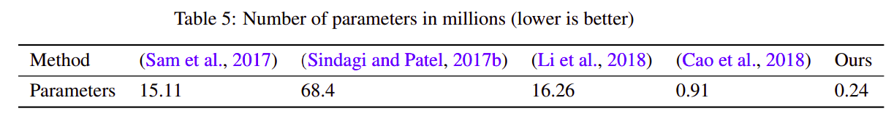
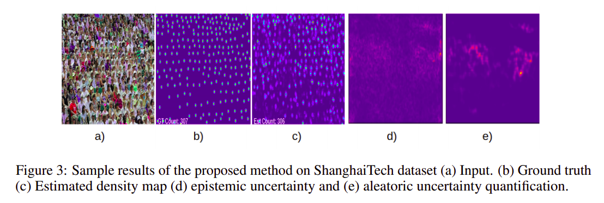
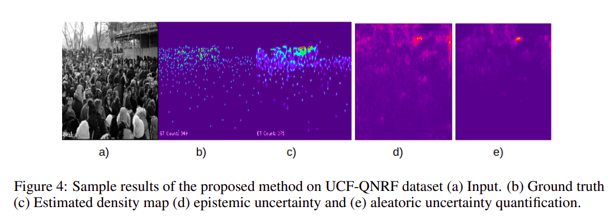

# Bayesian Multi Scale Neural Network for Crowd Counting
Code for the paper `Bayesian Multi Scale Neural Network for Crowd Counting`.


Link to [Paper](https://arxiv.org/pdf/2007.14245).

## Abstract

Crowd Counting is a difficult but important problem in computer vision. Convolutional Neural Networks based on estimating the density map over the image has
been highly successful in this domain. However dense crowd counting remains an
open problem because of severe occlusion and perspective view in which people
can be present at various sizes. In this work, we propose a new network which
uses a ResNet based feature extractor, downsampling block which uses dilated
convolutions and upsampling block using transposed convolutions. We present a
novel aggregation module which makes our network robust to the perspective view
problem. We present the optimization details, loss functions and the algorithm
used in our work. On evaluating on ShanghaiTech, UCF-CC-50 and UCF-QNRF
datasets using MSE and MAE as evaluation metrics, our network outperforms previous state of the art approaches while giving uncertainty estimates in a principled
bayesian manner.

## Data

The dataset can be downloaded from [ShanghaiTech](https://svip-lab.github.io/datasets.html), [UCF-CC-50](https://www.crcv.ucf.edu/research/data-sets/ucf-cc-50/) and [UCF-QNRF](https://www.crcv.ucf.edu/research/data-sets/ucf-qnrf/).

## Our Aggregation Module



## Network Architecture



## Algorithm



## Usage

1. Download datasets. 
2. `cd notebook`.
3. Run `generate_datasets.ipynb`.
4. Run `main.ipynb`.

## Results













## Citing

If you find this code useful in your research, please consider citing the paper:

```
@article{sagar2020bayesian,
  title={Bayesian Multi Scale Neural Network for Crowd Counting},
  author={Sagar, Abhinav},
  journal={arXiv preprint arXiv:2007.14245},
  year={2020}
}
```

## License

```
MIT License

Copyright (c) 2020 Abhinav Sagar

Permission is hereby granted, free of charge, to any person obtaining a copy
of this software and associated documentation files (the "Software"), to deal
in the Software without restriction, including without limitation the rights
to use, copy, modify, merge, publish, distribute, sublicense, and/or sell
copies of the Software, and to permit persons to whom the Software is
furnished to do so, subject to the following conditions:

The above copyright notice and this permission notice shall be included in all
copies or substantial portions of the Software.

THE SOFTWARE IS PROVIDED "AS IS", WITHOUT WARRANTY OF ANY KIND, EXPRESS OR
IMPLIED, INCLUDING BUT NOT LIMITED TO THE WARRANTIES OF MERCHANTABILITY,
FITNESS FOR A PARTICULAR PURPOSE AND NONINFRINGEMENT. IN NO EVENT SHALL THE
AUTHORS OR COPYRIGHT HOLDERS BE LIABLE FOR ANY CLAIM, DAMAGES OR OTHER
LIABILITY, WHETHER IN AN ACTION OF CONTRACT, TORT OR OTHERWISE, ARISING FROM,
OUT OF OR IN CONNECTION WITH THE SOFTWARE OR THE USE OR OTHER DEALINGS IN THE
SOFTWARE.
```


